<p></p>

# BKAi — Multi-Agent Admissions Counselor for HCMUT

> **Vietnamese admissions counseling for Ho Chi Minh City University of Technology (HCMUT · ĐHQG-HCM), by chat and by voice.**<br/>
> **Developed by:** Long Quan Ton<br/>
> **Stack:** LangGraph multi-agent · Gemini 3.5 Flash-Lite · Qdrant hybrid search · SQL fact DB · MCP · AssemblyAI + Kokoro voice · React 19<br/>
> **Version:** 5.0.0 — [what changed since v1](VERSION.md) · [deployment & security](docs/DEPLOYMENT.md) · [manual test script](docs/MANUAL_TEST.md) · [landing page & 60-s film](frontend/video/README.md) · [brand](brand/BRAND.md)

---

## 1. Executive Summary

BKAi answers the questions Vietnamese high-school students actually ask HCMUT: cut-off scores by major, program
and year, quotas, tuition, the 2026 combined-score formula, English certificate conversion, deadlines and campus life.
It also works as a counselor: it computes a student's admission score and sorts majors into *safe / match / reach*.

Every number comes from **official hcmut.edu.vn pages**. They are crawled, validated and loaded into **typed SQL tables**.
Agents query those tables through tools, write the answer with citations, and a **deterministic verifier** checks every
number against the evidence before the answer is finished.

### Key results (all measured — scripts and JSON reports are in `backend/evaluation/`)

| | Metric | v5 result | v4 (audited) |
|---|---|---|---|
| 🎯 | Real admission cases (easy → out-of-scope) | **8 / 8** | 4 / 5 |
| 🔢 | Numeric exact match: cut-offs and quotas, n = 200 | **200 / 200** (Wilson 95% ≥ 0.98) | wrong year on 1 of 5 |
| ⚡ | Cold answer latency p50 · p95 | **1.79 s · 5.0 s** | 27.3 s · 56.6 s |
| ⏱️ | Time to first token p50 | **1.11 s** | 17.7 s |
| 🔎 | Retrieval Hit@5 · Hit@1 (198 queries) | **0.955 · 0.828** | Hit@1 0.667 (24 queries) |
| 🛡️ | Guardrail probes: precision · recall (n = 60) | **60 / 60 · 1.0 · 1.0** | — |
| 🧑‍🎓 | 9-turn student conversation, end to end | **9 / 9** | — |
| 🧠 | Remembers score + major after distractor turns | **7 turns** (beyond the 12-message window) | — |
| 🎙️ | Voice: STT error · end of speech → first audio | **CER 1.26% · 2.55 s** | — |
| 👥 | Concurrency: 20 cache hits · 6 LLM answers | **p50 344 ms · 1.65 s, 0 errors, 0 leaks** | token leak between users |
| ✅ | Verifier pass rate · LLM calls per answer | **100% on the factual run (99.1% of 679 live answers) · 1.01** | 3–6 calls |

**v4 → v5: 15× faster cold answers, 16× faster first token, and every number in an answer is checked against the source.**

A larger run first found two real bugs (a major-name resolver gap and three missed "other university" questions: 199/200 and 57/60). Both were fixed with unit tests, and the suites were re-run. Earlier reports are kept in `backend/evaluation/reports/history/`.

### UI

<table>
  <tr>
    <td align="center"><b>App home (/chat)</b></td>
    <td align="center"><b>Answer with agent trace & sources</b></td>
  </tr>
  <tr>
    <td>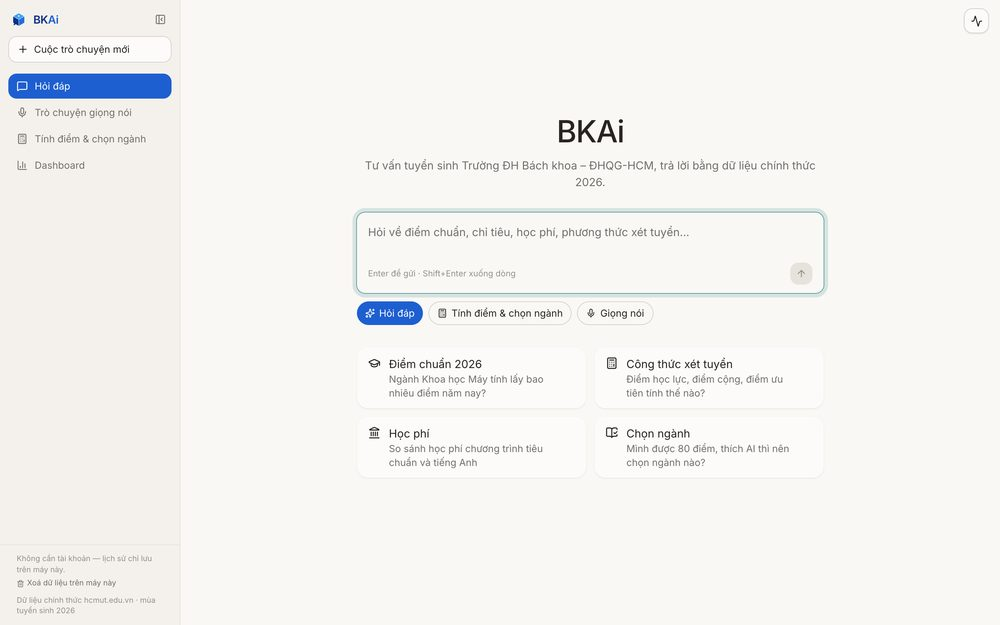</td>
    <td>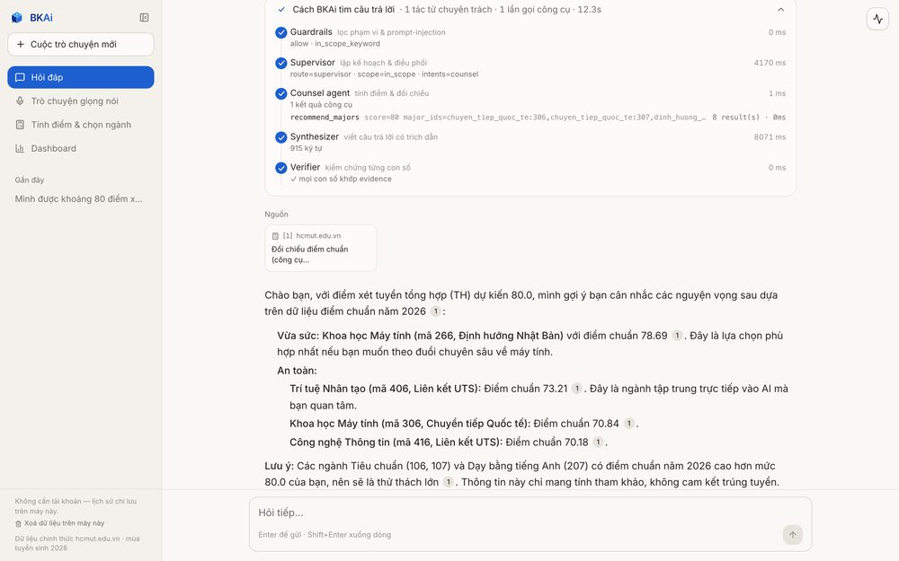</td>
  </tr>
  <tr>
    <td align="center"><b>Multi-turn follow-up</b></td>
    <td align="center"><b>Score calculator & major recommendations</b></td>
  </tr>
  <tr>
    <td>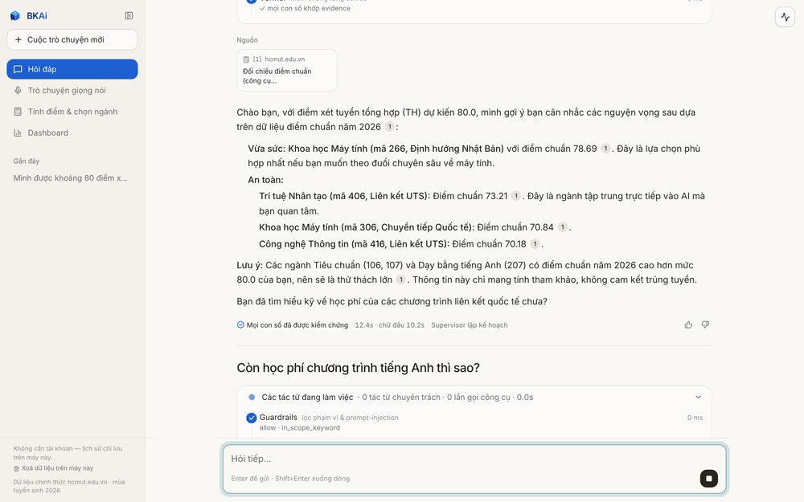</td>
    <td>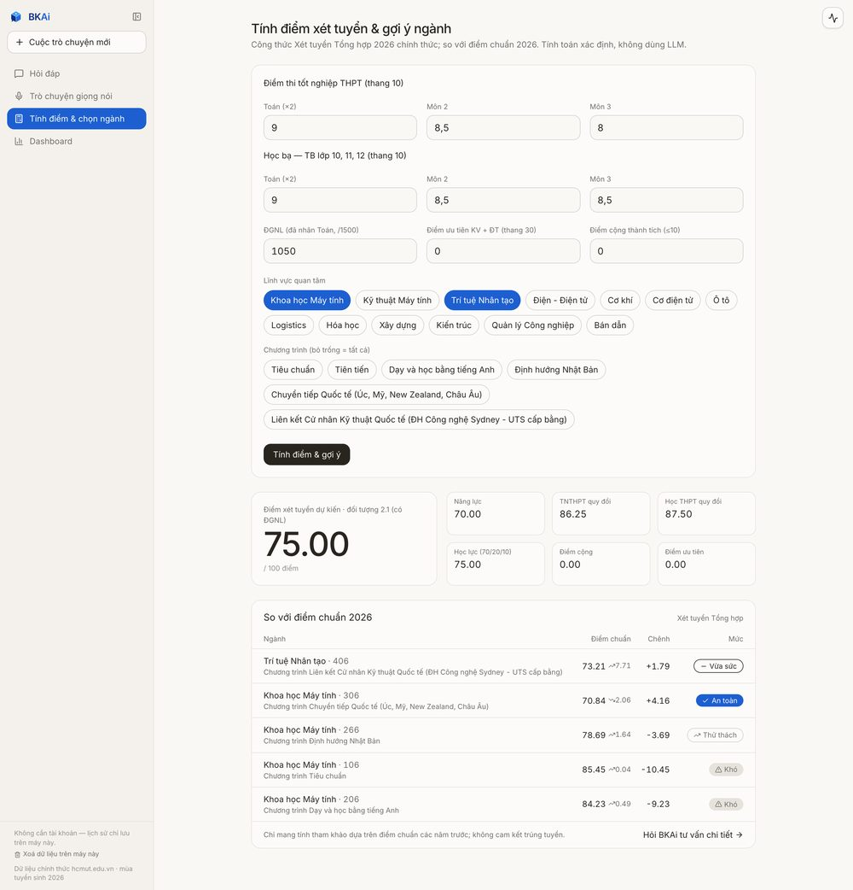</td>
  </tr>
  <tr>
    <td align="center"><b>Voice (AssemblyAI + Kokoro, barge-in)</b></td>
    <td align="center"><b>Owner dashboard — benchmarks</b></td>
  </tr>
  <tr>
    <td>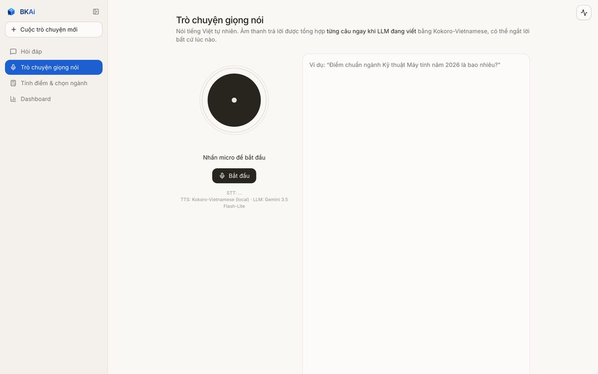</td>
    <td>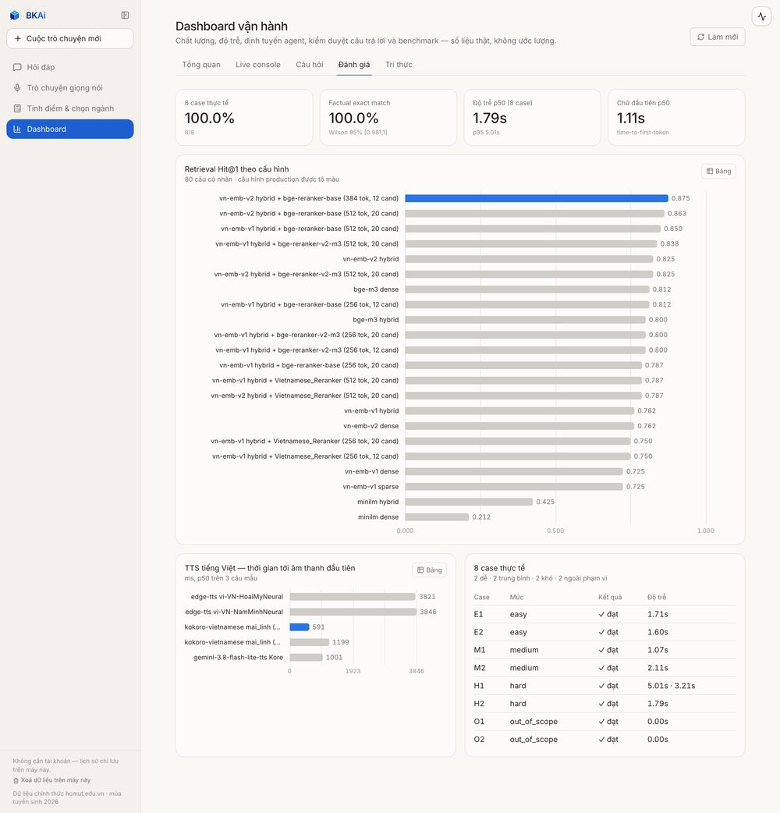</td>
  </tr>
  <tr>
    <td align="center"><b>Observability popup (live)</b></td>
    <td align="center"><b>Per-query trace: waterfall, Gemini calls, chunks</b></td>
  </tr>
  <tr>
    <td>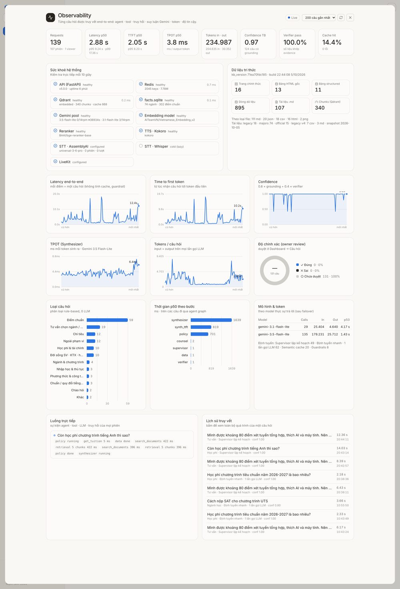</td>
    <td>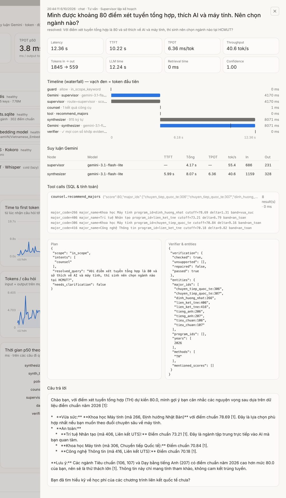</td>
  </tr>
</table>

<p align="center">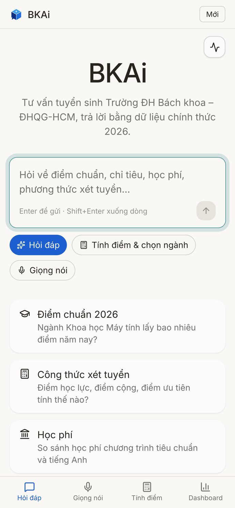<br/><sub>Responsive down to 360 px</sub></p>

### Landing page & 60-second film

<p align="center"><a href="frontend/public/media/trailer/bkai-trailer-web.mp4">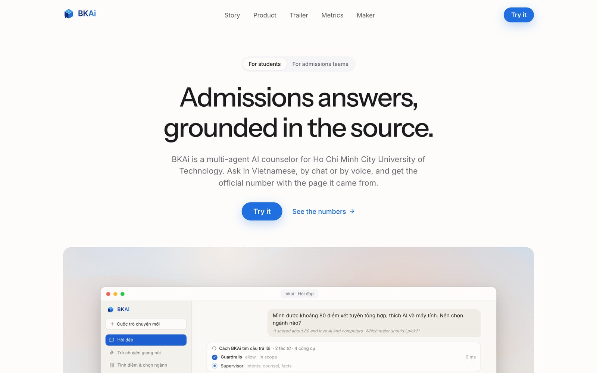</a></p>

The landing page is the app's front door at `/`, and **Try it** opens the counselor at `/chat`. The page has these sections:
- a hero with a live answer replay;
- proof numbers drawn as small charts;
- a marquee of the full stack;
- the maker, with awards and certification counts;
- background cards;
- real screens in a MacBook;
- the film, which plays muted with sound and caption toggles;
- a 15-tile bento of features;
- metrics tables with references.

The film is rendered from HTML frame by frame, voiced by Kokoro-82M and scored in code. See [frontend/video/README.md](frontend/video/README.md).

---

## 2. System Architecture

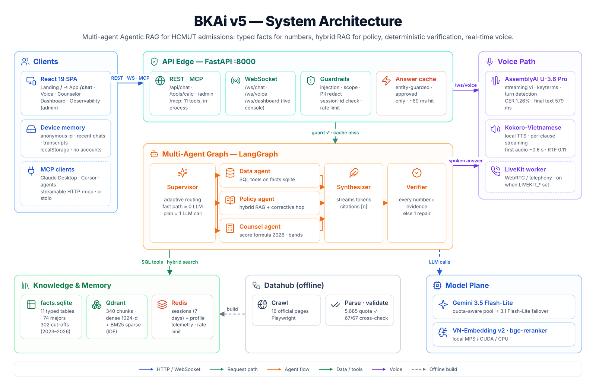

| Layer | Components |
|---|---|
| **Client** | React 19 SPA: landing page at `/`, chat at `/chat`, voice (AudioWorklet PCM16), calculator, dashboard, Observability popup. No accounts: memory is per device |
| **API edge** | FastAPI: REST + `/ws/chat`, `/ws/voice`, `/ws/dashboard`, MCP at `/mcp`; rate limits, Origin allow-list, PII redaction |
| **Agents** | LangGraph: Supervisor → Data / Policy / Counsel specialists (in parallel) → Synthesizer → Verifier |
| **Tools** | 11 read-only tools, also published over **MCP** (in the API at `/mcp`, or `mcp_server.py` over stdio) |
| **Knowledge** | `facts.sqlite` (11 tables) · Qdrant collection (340 chunks, dense + sparse) · answer cache collection |
| **State** | Redis: anonymous sessions (7 days), student profile, telemetry, rate-limit counters · browser `localStorage`: device id, recent chats, transcripts |
| **Models** | Gemini 3.5 Flash-Lite (3.1 Flash-Lite failover) · Vietnamese_Embedding_v2 · bge-reranker-base · AssemblyAI · Kokoro |

### Project structure

```
bkai2/
├── backend/
│   ├── datahub/        crawl → parse → validate → build (official hcmut.edu.vn → facts.sqlite + documents)
│   ├── knowledge/      entity resolver, SQL fact queries, admission-score formula, recommendation bands
│   ├── retrieval/      contextual chunking, embeddings, BM25 sparse vectors, Qdrant hybrid search, reranking
│   ├── agents/         supervisor, data / policy / counsel agents, synthesizer, verifier, LiveKit voice worker
│   ├── workflows/      LangGraph graph
│   ├── tools/          tool registry (shared by agents and MCP)
│   ├── services/       chat pipeline, Gemini pool, event bus, guardrails, PII, classification, audio, observability
│   ├── memory/         Redis sessions, student profile, telemetry, answer cache
│   ├── api/            REST, WebSockets, voice, security middleware
│   ├── evaluation/     benchmarks + datasets + reports/*.json
│   ├── tests/          36 unit tests (no network)
│   ├── ingest.py       chunk → embed → index into Qdrant
│   └── mcp_server.py   MCP server (stdio; also mounted in the API at /mcp)
├── frontend/           React 19 + TypeScript + Vite + Tailwind v4 + framer-motion
│                       src/landing = landing page at "/", src/pages = the app (/chat …), video/ = the 60-s film pipeline
├── start.sh · stop.sh  start / stop everything locally (no Docker)
├── scripts/            smoke_prod.py (post-deploy checks), start-infra.sh (Redis + Qdrant in Docker)
├── brand/              logo files and brand guide (BRAND.md)
├── deploy/Caddyfile    TLS reverse proxy for production
├── docs/               diagrams/ (HTML sources, render + optimize scripts), image/, DEPLOYMENT.md, MANUAL_TEST.md, PLAN_v5.md
├── docker-compose.yml  + docker-compose.prod.yml
└── VERSION.md          v1 → v5 comparison
```

---

## 3. Technology Stack

| Area | Choice | Why (evidence) |
|---|---|---|
| LLM | **Gemini 3.5 Flash-Lite**, `thinking_level=minimal`; failover **3.1 Flash-Lite** | p50 1.4 s per call; quota-aware pool (14 RPM/model) switches models before the first token on 429/503 |
| Orchestration | **LangGraph** 1.x | parallel fan-out with typed state and an evidence reducer |
| Fact store | **SQLite** (`facts.sqlite`) | numbers are looked up exactly, never retrieved as text |
| Vector DB | **Qdrant** (embedded or server) | dense + sparse named vectors, RRF fusion in the server, payload filters |
| Embedding | **AITeamVN/Vietnamese_Embedding_v2** (1024-d) | best of 4 models on the 80-query selection run; Hit@1 0.475 → 0.813 vs MiniLM on 198 queries |
| Reranker | **BAAI/bge-reranker-base**, len 384, 12 candidates | lifts policy Hit@1 0.74 → 0.82 (198 q); the Vietnamese reranker scored lower (0.787 vs 0.875 on 80 q) |
| Cache & memory | **Redis** 8 | anonymous sessions (7 days), profile, telemetry, rate limits |
| STT | **AssemblyAI Universal-3.6 Pro** streaming · Whisper large-v3-turbo only without an AssemblyAI key | CER 1.26%, final transcript 579 ms after speech |
| TTS | **Kokoro-Vietnamese** (local) · edge-tts / Gemini TTS fallbacks | first byte 591 ms vs 1,001 ms (Gemini) and 3,821 ms (edge) |
| Realtime voice | **LiveKit Agents** 1.8.4 worker (optional) | WebRTC / SIP |
| Tool protocol | **MCP** Python SDK 2.x | the same 11 tools for Claude Desktop, IDEs and other agents |
| Crawling | **Playwright** + system Chrome, markdownify | the admissions site renders tables with JavaScript |
| API | **FastAPI**, uvicorn, Pydantic v2 | |
| Frontend | **React 19**, TypeScript, Vite, **Tailwind v4**, **framer-motion**, lucide, simple-icons | app tokens from `DESIGN.md`, landing tokens from `Landing Page_DESIGN.md`, Bách Khoa brand ([brand/BRAND.md](brand/BRAND.md)); self-hosted fonts; charts are custom SVG |
| Deploy | Docker (non-root), **Caddy** auto-HTTPS | `docker-compose.prod.yml` |

---

## 4. Data: From Official Pages to Typed Tables

### 4.1 Sources and reorganisation

v4 kept hand-copied CSV/Markdown files with no 2026 cut-offs. v5 rebuilds the knowledge base from **16 official
hcmut.edu.vn pages** (13 HTML tables, 128,912 characters, 2 formula images transcribed by hand), saved as a dated snapshot.

The data is reorganised **before** ingest, following one rule: **every fact has one home**.

1. **Numbers → typed tables.** Cut-offs, quotas, tuition and conversions become rows keyed by year × major × method.
   Agents read them with SQL, so years and programs cannot get mixed up.
2. **Policy text → documents.** Each official page becomes Markdown with front-matter (URL, fetch date, type).
3. **One card per admission code.** 74 generated "major cards" join each code's name, program, combinations,
   partners and recent cut-offs, so a question like "KTMT CLC" finds one complete chunk.
4. **Legacy only where evergreen.** 18 background sections from v4 (campus life, dorms…) are kept and labelled `legacy`.

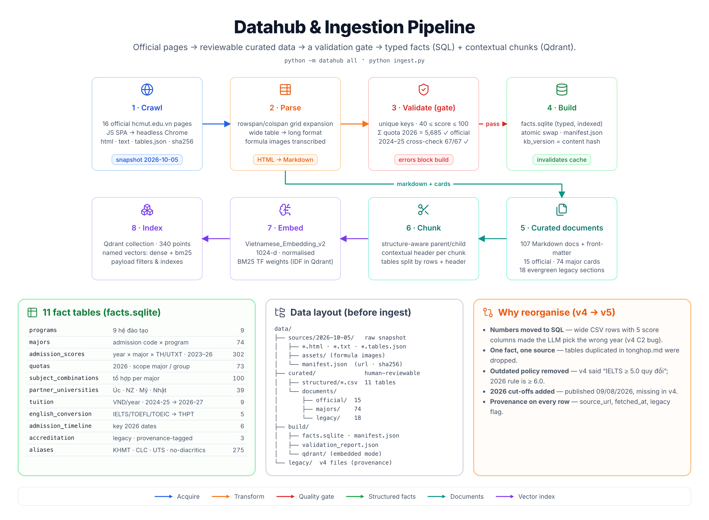

### 4.2 The 11 fact tables (`data/curated/structured/*.csv` → `data/build/facts.sqlite`)

| Table | Rows | Grain |
|---|---:|---|
| `admission_scores` | 302 | year × major × method (2023–2026; TH combined score, UTXT priority) |
| `aliases` | 275 | alias → major / program (KHMT, CLC, UTS, accent-free forms…) |
| `subject_combinations` | 100 | major × subject combination |
| `majors` | 74 | admission code within a program |
| `quotas` | 73 | year × major (or program group) |
| `partner_universities` | 39 | major × partner university |
| `programs` | 9 | training program (standard, English-taught, Japan-oriented, transfer, UTS…) |
| `tuition` | 9 | academic year × program group (VND / year) |
| `admission_timeline` | 6 | key 2026 dates |
| `english_conversion` | 5 | certificate band → THPT English score |
| `accreditation` | 3 | accreditation level × counts |

**Files on disk:** 111 Markdown · 20 JSON · 18 CSV · 16 HTML · 2 PNG. **Documents:** 15 official · 74 major cards · 18 legacy.

**Validation gate** (`python -m datahub validate`, 0 errors): unique keys, 40 ≤ score ≤ 100, referential integrity,
**Σ 2026 quota = 5,685** (the official total), and **67 / 67** scores from 2024–2025 match an independent copy.
The build is swapped in atomically and stamped with a content-hash `kb_version`, which also scopes the answer cache.

```bash
cd backend
python -m datahub all      # crawl → parse → validate → build
python ingest.py           # chunk → embed → index into Qdrant
```

### 4.3 Chunking

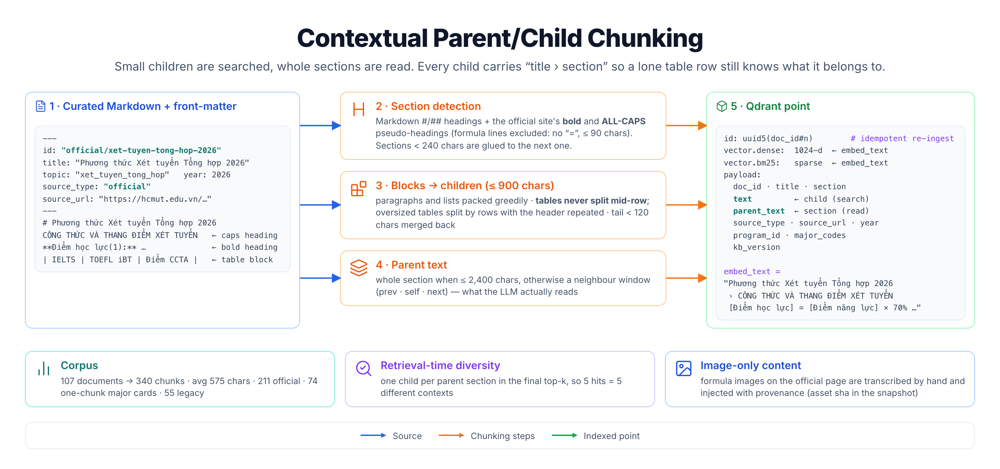

- Documents are split on Markdown headings, plus bold or upper-case lines that act as headings. Sections under 240 characters are merged.
- **Child chunks** (≤ 900 characters) are embedded. Their **parent** (≤ 2,400 characters) goes to the LLM, so tables and formulas stay whole.
- Each chunk is embedded with a `title › section` prefix (contextual retrieval). Large tables are split with the header repeated.
- **Result:** 107 documents → **340 chunks** (211 official · 74 major cards · 55 legacy), 575 characters on average.

---

## 5. Hybrid Retrieval

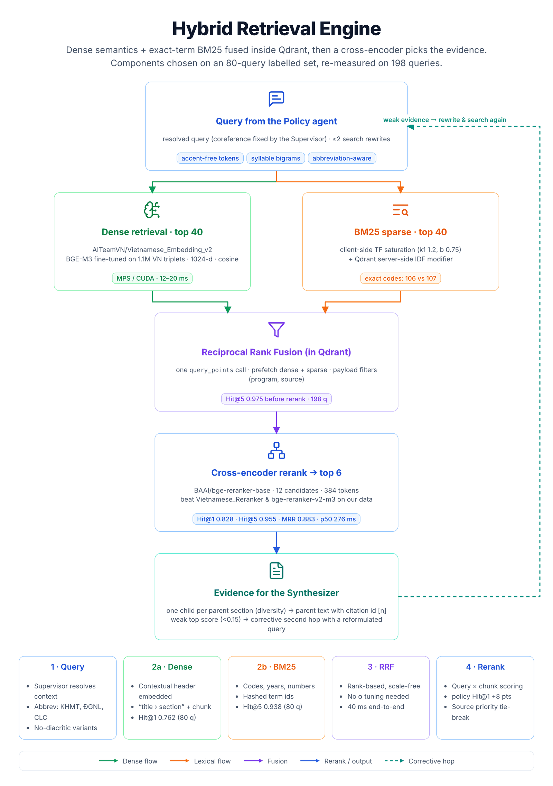

1. **Dense:** Vietnamese_Embedding_v2 query vector.
2. **Sparse:** BM25 vector (hashed tokens, including accent-free forms and bigrams). TF saturation runs in the client; IDF is applied by Qdrant.
3. **Fusion:** Qdrant prefetches 40 candidates per branch and fuses them with **RRF**, with optional program / source filters.
4. **Rerank:** bge-reranker-base scores the top 12 query–chunk pairs and the top 6 parents are returned.
5. **Corrective hop:** if the best rerank score is below 0.15, the Policy agent reformulates the query once (CRAG-style).

**Benchmark** (`evaluation/run_retrieval_bench.py`).

`--scaled` uses 198 queries: every major with 2 phrasings, plus 50 policy questions. The report is `retrieval_bench_scaled.json`:

| Configuration | Hit@1 | Hit@3 | Hit@5 | MRR@10 | p50 |
|---|---:|---:|---:|---:|---:|
| MiniLM-L12 hybrid (v4 embedding) | 0.475 | 0.859 | 0.924 | 0.674 | 31 ms |
| Vietnamese_Embedding_v2 hybrid | 0.813 | 0.955 | 0.975 | 0.886 | 38 ms |
| **+ bge-reranker-base — shipped** | **0.828** | 0.929 | **0.955** | 0.883 | 276 ms |

Model selection used 80 labelled queries (50 policy + 30 major), testing 4 embeddings × 3 modes × 3 rerankers:

| Configuration | Hit@1 | Hit@5 | MRR@10 | nDCG@10 | p50 |
|---|---:|---:|---:|---:|---:|
| MiniLM-L12 hybrid (v4 embedding) | 0.425 | 0.900 | 0.641 | 0.711 | 28 ms |
| bge-m3 hybrid | 0.800 | 0.950 | 0.872 | 0.885 | 41 ms |
| Vietnamese_Embedding_v2 hybrid | 0.825 | 0.963 | 0.885 | 0.887 | 41 ms |
| + bge-reranker-v2-m3 (len 512, 20 candidates) | 0.825 | 0.988 | 0.901 | 0.912 | 1,430 ms |
| + Vietnamese_Reranker (len 512, 20 candidates) | 0.787 | 0.975 | 0.874 | 0.892 | 1,431 ms |
| **+ bge-reranker-base (len 384, 12 candidates) — shipped** | **0.875** | 0.950 | **0.912** | **0.915** | **307 ms** |

---

## 6. Multi-Agent Orchestration

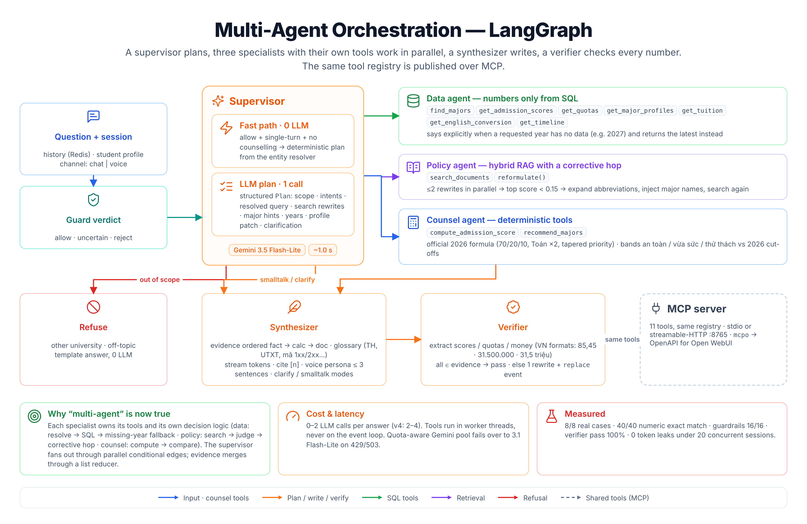

| Node | LLM | Job |
|---|---|---|
| **Guardrails** | 0 | rules for other universities, off-topic requests and prompt injection (< 1 ms); unclear inputs go to the Supervisor |
| **Supervisor** | 0 or 1 | **fast path:** the resolver finds the major, year and intent → no LLM call. Otherwise one structured call returns the plan: scope, intents, rewritten question and a profile patch |
| **Data agent** | 0 | SQL tools: scores, quotas, tuition, English conversion, timeline, major profiles |
| **Policy agent** | 0 | hybrid search + rerank + corrective hop |
| **Counsel agent** | 0 | official 2026 score formula and safe / match / reach bands from the student profile |
| **Synthesizer** | 1 (streamed) | answers in Vietnamese with `[n]` citations; evidence is treated as data, not instructions |
| **Verifier** | 0 (+1 repair) | every number in the answer must appear in the evidence; otherwise one repair call |

The specialists run **in parallel**. Typical answers use **0–2 Gemini calls** (1.01 on average): 556 of 792 logged requests took the fast path.

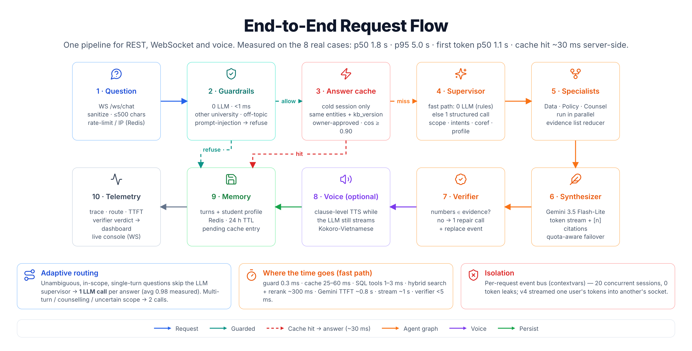

---

## 7. Memory, Answer Cache & Owner Loop

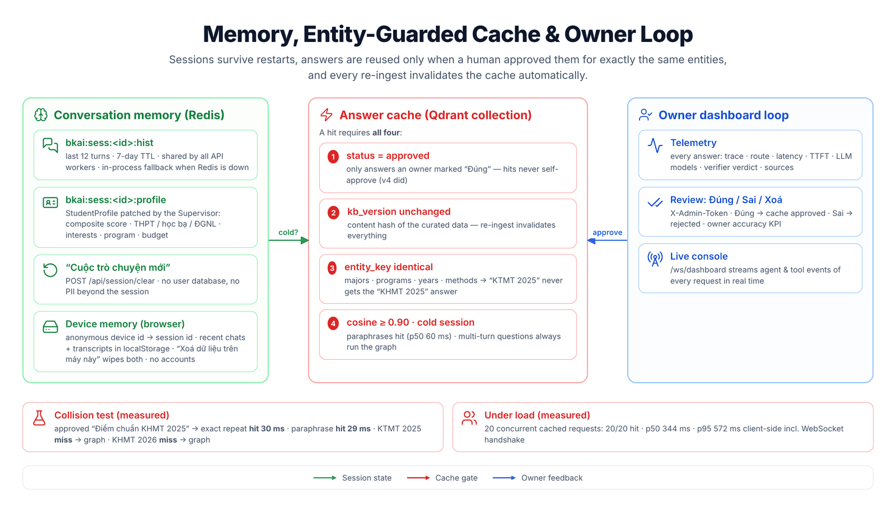

- **No accounts, per-device memory:** each browser keeps a random session id, its recent chats and their transcripts in `localStorage`, so a returning student continues where they left off. The server keys memory only by that id. Invalid or placeholder ids (`"default"`…) are replaced, so two visitors never share a memory. **Xoá dữ liệu trên máy này** in the sidebar wipes both sides (for shared computers).
- **Short-term memory:** the last 12 messages in Redis (7-day TTL).
- **Structured StudentProfile:** scores, preferred majors, program and region, updated by the Supervisor's patch.
  This is why the memory test still recalls the student's score and major **after 7 distractor turns**, beyond the message window.
- **Answer cache:** served only when all of these hold:
  - the owner **approved** the answer;
  - the entity key matches exactly (major, program, year, method);
  - the `kb_version` is the same;
  - cosine similarity is ≥ 0.90;
  - the session is new (no context to lose).

  "KHMT 2025" can never return a "KTMT 2025" answer.
- **Owner loop:** Dashboard → Câu hỏi lists every question. Marking an answer correct or incorrect feeds the accuracy chart and the cache.

---

## 8. Voice

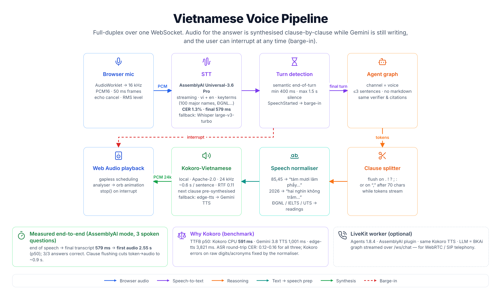

- **`/ws/voice`, full duplex.** The browser streams 16 kHz PCM. AssemblyAI returns partial and final transcripts using HCMUT keyterms and semantic turn detection.
- **Spoken answers.** The graph answers in at most 3 sentences with no markdown. The answer is split into clauses and synthesised by Kokoro while Gemini is still writing.
- **Speech normaliser.** Numbers, dates, money and acronyms are read naturally ("85,45" → *tám mươi lăm phẩy bốn lăm*).
- **Barge-in.** Speaking while the bot talks stops playback immediately. Sessions are capped at 10 minutes.

| Voice benchmark | Result |
|---|---|
| AssemblyAI transcription (spoken by a different neural voice) | **CER 1.26%**, 3 / 3 correct answers |
| End of speech → final transcript (p50) | **579 ms** |
| End of speech → first answer audio (p50) | **2.55 s** |
| TTS time to first byte (p50): Kokoro CPU · Gemini TTS · edge-tts | **591 ms** · 1,001 ms · 3,821 ms |

---

## 9. MCP Server

The same tools the agents use are published over the Model Context Protocol, so Claude Desktop, IDE agents or other systems can query the official data.

```bash
python mcp_server.py                     # stdio (Claude Desktop, Cursor, Claude Code)
# streamable HTTP is built into the API: http://127.0.0.1:8000/mcp  (blocked at the proxy in production; MCP_HTTP=false turns it off)
```

Tools: `find_majors`, `list_majors`, `get_admission_scores`, `get_quotas`, `get_major_profiles`, `get_tuition`,
`get_english_conversion`, `get_timeline`, `search_documents`, `compute_admission_score`, `recommend_majors`.
All of them are read-only.

---

## 10. Observability

Click the **activity icon (top right)** to open the Observability popup. It updates live over `/ws/dashboard`:

- **Health:** 11 components (API, Redis, Qdrant, facts DB, Gemini pool, embedder, reranker, Kokoro, AssemblyAI, Whisper, LiveKit).
- **KPIs:** request count, latency p50/p90/p95/p99, TTFT, TPOT, input/output tokens, confidence, verifier pass rate, cache hit rate, errors.
- **Charts:**
  - latency, TTFT, TPOT, confidence and tokens over time;
  - accuracy donut from owner reviews;
  - question categories (12 classes) and route mix;
  - p50 per pipeline stage;
  - per-model calls, tokens and latency.
- **Data inventory:** crawl snapshot, rows per fact table, documents and files by type, `kb_version`.
- **Live feed:** every event of a running question, grouped by question ID.
- **Query trace:** click any question to open its full record:
  - a waterfall of guard → supervisor → agents → tools → Gemini (the first-token tick is marked) → verifier;
  - each Gemini call's model, TTFT, TPOT, tokens and tokens/s;
  - the ranked chunks with rerank scores;
  - tool result previews, the plan, the verifier verdict and the answer.

Real-time check: over 12 questions, **215 events** streamed, 0 without a question ID, about 13 events per question
arrived before `done`, and every trace was complete and in order. Example diagnosis: a 10.5 s turn was the failover
model's 6.7 s TTFT after the primary quota ran out; retrieval took only 0.75 s.

---

## 11. Evaluation

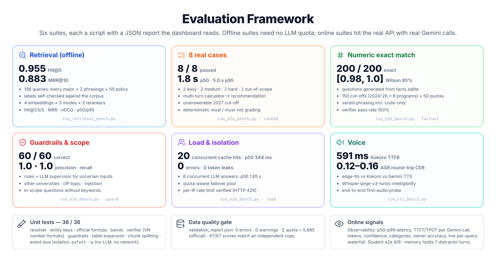

```bash
cd backend
pytest -q                                                          # 36 unit tests, no network
python -m evaluation.run_retrieval_bench --scaled                  # retrieval, 198 queries (no LLM quota)
python -m evaluation.run_e2e_bench --api ws://127.0.0.1:8000 --factual 200 --gap 2.3   # cases8 · factual · guard · student · memory · load
python -m evaluation.run_voice_bench --api ws://127.0.0.1:8000     # AssemblyAI + Kokoro end to end
python -m evaluation.run_tts_bench                                 # TTS latency + intelligibility
```

| Suite | n | Result | Latency |
|---|---:|---|---|
| Real cases (2 easy · 2 medium · 2 hard · 2 out-of-scope) | 8 | **8 / 8** | p50 1.79 s · p95 5.0 s · TTFT p50 1.11 s |
| Numeric exact match (150 cut-offs + 50 quotas) | 200 | **200 / 200**, Wilson 95% 0.981–1.0, verifier 100% | p50 1.89 s · TTFT p50 1.04 s |
| Guardrails (31 refuse · 29 answer) | 60 | **60 / 60**, precision 1.0 · recall 1.0 | rules < 1 ms |
| Retrieval | 198 | Hit@5 0.955 · Hit@1 0.828 | p50 276 ms |
| Student conversation (greeting → score → advice → tuition → deadline) | 9 turns | **9 / 9** | — |
| Memory depth | 0 / 3 / 7 distractors | remembered at every depth | — |
| Load: cache hits | 20 concurrent | 0 errors, isolated | p50 344 ms · p95 572 ms |
| Load: LLM answers | 6 concurrent | 0 errors, isolated | p50 1.65 s · p95 2.12 s |

**Real traffic** (`python -m evaluation.summarize_telemetry` → `reports/telemetry_summary.json`, 792 requests from all test sessions):

| View | n | p50 | p95 | p99 | TTFT p50 |
|---|---:|---:|---:|---:|---:|
| Steady state | 412 | **1.7 s** | **4.6 s** | 6.4 s | 0.9 s |
| All LLM requests | 679 | 2.3 s | 11.1 s | 22.4 s | 1.4 s |
| BKAi's own processing (latency − Gemini time) | 679 | **0.13 s** | 0.85 s | — | — |

Steady state excludes 267 requests:
- 8 first requests after a restart;
- 24 Gemini 503/504 errors handled by failover;
- 232 answered by the fallback model while benchmarks pushed past the free tier's 15 requests/minute;
- 3 provider stalls (more than 8 s to the first token).

785 of 792 requests were answered. The other 7 got a polite "busy" reply during a burst run deliberately above the quota.
The verifier passed 673 of 679 live answers. The long tail comes from the provider, not from the pipeline. See [Deployment](#12-security--deployment).

---

## 12. Security & Deployment

Controls are mapped to the **OWASP Top 10 for LLM Applications (2026)**; the full table is in [docs/DEPLOYMENT.md](docs/DEPLOYMENT.md).

| Threat | Control |
|---|---|
| Prompt injection | rule guard; prompts mark evidence and the question as *data*; tools are read-only |
| Sensitive data | ID-card numbers, phone numbers and emails are **redacted before** the LLM, Redis, telemetry and logs; no accounts; anonymous 7-day sessions with validated ids |
| Misinformation | numbers come only from the fact DB; the deterministic verifier checks every number |
| Unbounded consumption | per-IP **30/min and 400/day** (production: 20 / 300); ≤ 6 WebSockets per IP; 500-character input cap; 64 KB body cap; 10-minute voice sessions |
| Hidden context exposure | admin and observability endpoints need `X-Admin-Token` (constant-time comparison); the app refuses to start in production without it; `/docs` is disabled in production |
| WebSocket abuse | **Origin allow-list** (CORS does not cover WebSockets); per-IP socket cap |
| Data poisoning | official sources only; validation gate; content-hashed `kb_version` |
| Web layer | Caddy TLS, HSTS, CSP, `nosniff`, `frame-ancestors 'none'`; `X-Forwarded-For` trusted only from the proxy; non-root containers; Qdrant API key on the internal network |

**Production** (step-by-step pilot guide for ~10 users/day in [docs/DEPLOYMENT.md §0](docs/DEPLOYMENT.md)):

```bash
# repo-root .env: BKAI_DOMAIN, QDRANT_API_KEY · backend/.env: GOOGLE_API_KEY, ADMIN_TOKEN, ASSEMBLYAI_API_KEY
docker compose -f docker-compose.yml -f docker-compose.prod.yml up -d --build
docker compose -f docker-compose.yml -f docker-compose.prod.yml run --rm backend python ingest.py
backend/.venv/bin/python scripts/smoke_prod.py --base https://$BKAI_DOMAIN --admin-token $ADMIN_TOKEN
```

Behind one origin, Caddy serves the SPA (landing `/`, app `/chat`) and proxies `/api` and `/ws` to FastAPI. Production builds call
the API on the same origin, fonts are self-hosted, and the CSP allows nothing else.
Rollout: staging → closed pilot (20–50 students, daily owner review) → soft launch → paid Gemini tier for cut-off week.
Sizing: 4 vCPU / 8 GB RAM. Details, exit criteria and operations are in [docs/DEPLOYMENT.md](docs/DEPLOYMENT.md).

---

## 13. Getting Started (local, no Docker)

**Requirements:** Python 3.12, Node 20+, Redis on :6379, Google Chrome (for crawling), and a Gemini API key.
An AssemblyAI key is optional; without it, voice falls back to Whisper.

```bash
# 1 · backend
cd backend
python3.12 -m venv .venv && source .venv/bin/activate
pip install -r requirements.txt
cp .env.example .env            # set GOOGLE_API_KEY (and ASSEMBLYAI_API_KEY for streaming voice)
python -m datahub all           # crawl + build the fact DB (≈1 min)
python ingest.py                # build the Qdrant index (models download on first run)
uvicorn main:app --port 8000

# 2 · frontend
cd ../frontend && npm install && npm run dev     # landing http://localhost:5173 · app http://localhost:5173/chat
# production-like: npm run build && npm run preview   (one origin on :4173, /api and /ws proxied like Caddy)

# optional
python mcp_server.py                              # MCP tools over stdio
python -m agents.voice_livekit dev                # LiveKit realtime worker
```

**One command for everything.** It runs Redis, then the backend (chat API, voice over AssemblyAI + Kokoro, MCP at `/mcp`), then the frontend (landing + app), then the LiveKit worker if `LIVEKIT_*` is set. Everything runs in the background, and logs go to `.run/logs/`:

```bash
./start.sh              # starts everything and opens http://localhost:5173 (app at /chat)
./start.sh --rebuild    # re-crawl hcmut.edu.vn and rebuild the knowledge base first
./stop.sh               # stop everything (--redis also stops Redis)
```

With an AssemblyAI key, the Whisper fallback is never loaded. MCP clients connect to `http://127.0.0.1:8000/mcp` (streamable HTTP),
or run `backend/mcp_server.py` over stdio.

With Docker: `docker compose up -d --build`. The API already serves MCP at `/mcp`; add `--profile voice` for the LiveKit worker, or `--profile mcp` for a standalone MCP server on :8765.
For a 25-minute walkthrough of every feature, see [docs/MANUAL_TEST.md](docs/MANUAL_TEST.md).

### Main endpoints

| Endpoint | Purpose | Access |
|---|---|---|
| `POST /api/chat`, `WS /ws/chat` | ask (streamed tokens + agent events) | public, rate-limited |
| `WS /ws/voice` | full-duplex voice | public, Origin-checked, rate-limited |
| `POST /api/tools/calc`, `GET /api/majors`, `GET /api/kb` | calculator, major list, knowledge-base summary | public |
| `POST /api/voice/tts`, `GET /api/voice/config` | speak a text, voice settings | public |
| `POST /api/feedback`, `POST /api/session/clear` | 👍/👎, reset a session | public |
| `GET /api/health` | liveness | public |
| `GET /api/observability/*`, `/api/stats`, `/api/questions`, `/api/eval` | Observability and dashboard | admin token |
| `POST /api/admin/review`, `/api/admin/delete` | owner review and cache approval | admin token |
| `WS /ws/dashboard?token=` | live event feed | admin token |

### Key configuration (`backend/.env`)

| Variable | Default | Meaning |
|---|---|---|
| `GEMINI_MODEL_PRIMARY` / `GEMINI_MODEL_FALLBACKS` | `gemini-3.5-flash-lite` / `gemini-3.1-flash-lite` | model pool |
| `GEMINI_RPM_PER_MODEL` | 14 | stays under the free tier's 15 RPM |
| `QDRANT_URL` | *(empty)* | empty = embedded local mode in `data/build/qdrant` |
| `EMBEDDING_MODEL` / `RERANKER_MODEL` | Vietnamese_Embedding_v2 / bge-reranker-base | chosen by benchmark |
| `CACHE_THRESHOLD` | 0.90 | similarity floor for approved answers |
| `APP_ENV` | development | `production` enables strict mode |
| `RATE_LIMIT_PER_MINUTE` / `RATE_LIMIT_PER_DAY` | 30 / 400 | per client IP |
| `ADMIN_TOKEN` | *(empty)* | required in production |
| `TRUSTED_PROXIES` | *(empty)* | proxies allowed to set `X-Forwarded-For` |
| `VOICE_TTS_PROVIDER` | kokoro | `kokoro`, `edge` or `gemini` |
| `ASSEMBLYAI_API_KEY` | *(empty)* | enables streaming STT |

---

## 14. Troubleshooting

| Symptom | Cause | Fix |
|---|---|---|
| Answers suddenly take 5–10 s | primary Gemini model hit 15 RPM; the pool failed over | Observability → model table shows `3.1-flash-lite` calls; wait, or enable billing |
| HTTP 429 "Bạn hỏi hơi nhanh" | per-IP quota | raise `RATE_LIMIT_PER_MINUTE` for testing |
| Observability asks for a token | `ADMIN_TOKEN` is set | paste the same token into the prompt |
| `SSL: CERTIFICATE_VERIFY_FAILED` on voice (macOS python.org build) | missing CA bundle | already handled via `certifi`; otherwise run `Install Certificates.command` |
| Voice says "Whisper" instead of AssemblyAI | `ASSEMBLYAI_API_KEY` is empty | set the key and restart |
| `datahub validate` fails | the official site changed | read `data/build/validation_report.json`; the running API keeps the previous build |
| WebSocket closes with 1008 | Origin not in `API_CORS_ORIGINS` | add the frontend origin |
| A shared computer shows someone else's chats | per-device memory by design | sidebar → **Xoá dữ liệu trên máy này** |
| The film does not start by itself | the browser blocks autoplay, or reduced motion is on | press play; sound and captions are separate toggles |

---

## 15. Limitations & Roadmap

- The free Gemini tier (15 RPM per model) caps throughput; use a paid tier or several projects for peak season.
- Embedding and reranking run in-process on CPU. Next step: a TEI server or a small GPU (rerank under 60 ms).
- Kokoro-Vietnamese is intelligible, but its prosody is less natural than cloud voices.
- The TNE program page returned no tables during the crawl; that program is covered by legacy text.
- Next: Langfuse traces, RAGAS faithfulness on policy answers, Postgres for multi-instance telemetry,
  and a scheduled crawl during admission season.

---

_BKAi v5.0.0 · all metrics reproducible from `backend/evaluation/` · version history in [VERSION.md](VERSION.md)_
