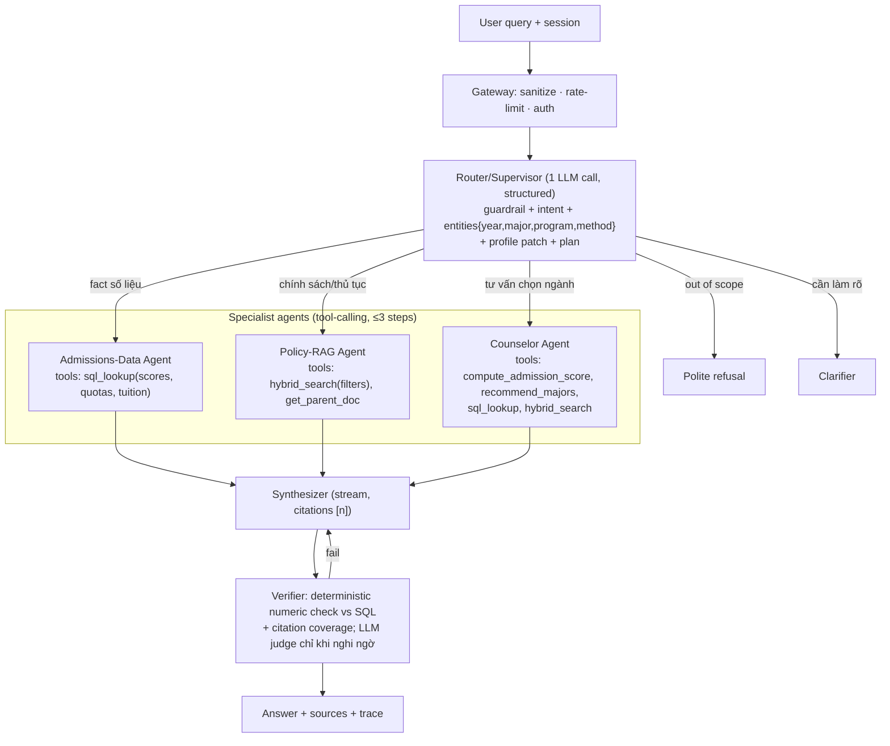

# BKAi v5 — Audit · Benchmark · Kế hoạch nâng cấp A→Z

> Ngày audit: 2026-10-05 · Branch: `voice_agent` @ `196c38d` · Người thực hiện: Claude (cùng Long Quan Ton)
> Phạm vi: đọc toàn bộ repo, test không dùng Docker (uvicorn + Redis local DB 14/15, đã dọn sạch sau test), benchmark retrieval offline + 5 case E2E thật qua WebSocket, research công nghệ tháng 10/2026.

---

## 0. TL;DR

| Hạng mục | Trạng thái | Bằng chứng |
|---|---|---|
| Pipeline chạy được end-to-end | ✅ Chạy | 5/5 case trả lời, không crash |
| Độ chính xác (5 case thật, chấm tay) | ⚠️ 4/5 case · 5/6 lượt | C2 trả **sai năm** (hỏi 2025 → đưa số 2024) |
| Latency thực tế | ❌ p50 **27.3s**, max **56.6s**, TTFT p50 **17.7s** | README ghi 5.8s — sai lệch ~5× |
| Semantic cache | ❌ **Trả nhầm ngành** | Hỏi *Kỹ thuật Máy tính* → nhận đáp án *Khoa học Máy tính* (cache hit 0.22s) |
| Streaming khi nhiều user | ❌ **Rò dữ liệu chéo phiên** | 2 user đồng thời: A nhận 0 token, B nhận token của cả A lẫn B |
| Self-reflection retry | ❌ Stream bị nhân đôi | Client nhận 2787 ký tự, đáp án cuối 1668 ký tự |
| "Multi-Agent" | ⚠️ Sai định nghĩa | Thực chất là 1 pipeline tuần tự (state machine), không có agent tự chủ/tool/handoff |
| Multi-hop retrieval | ❌ Không bao giờ chạy | Điều kiện `score > 0.01` trên reranker sigmoid luôn đúng; `follow_up_query` không được dùng |
| MCP / "MCPO" | ❌ Không tồn tại | MCP scraper đã bị xoá ở commit `850a682`; chưa từng có MCPO |
| Kokoro TTS | ❌ Không có trong repo | Voice hiện dùng edge-tts + faster-whisper/Deepgram |
| Dữ liệu | ❌ **Cũ** | KB có điểm chuẩn 2025; điểm chuẩn **2026 đã công bố 09/08/2026** |
| Số liệu README | ❌ Không kiểm chứng được | "n=120 golden set, 87%" — repo chỉ có 11 câu golden + 20 demo case (17/20), metric `run_eval.py` là "có answer & confidence ≥ 0.5", không phải accuracy |
| Rate limit / auth admin | ❌ Không có | README nói 15 RPM/IP — không có middleware; `/api/admin/*` không auth |
| Frontend type-check | ✅ `tsc -b` pass | |
| Guardrail rule-based | ✅ 8/8 case probe đúng | |

**Kết luận:** nền tảng (ingest → hybrid search → LangGraph → Gemini → cache → UI/voice) đúng hướng và chạy được, nhưng có 3 lỗi production-blocking (cache nhầm ngành, rò stream chéo user, dữ liệu cũ), latency gấp 5 lần tuyên bố, và định nghĩa "Multi-Agent" chưa đúng. Không nên deploy/đưa vào CV với số liệu hiện tại.

---

## 1. Dự án hiện tại hoạt động như thế nào

```
Browser (React 19 / Vite / Tailwind v4)
  ├─ ChatPage ── WebSocket /ws/chat ─┐
  ├─ VoicePage ─ REST /api/voice/* ──┤        LiveKit worker (optional)
  └─ Dashboard ─ REST /api/stats + WS /ws/dashboard   └─ Deepgram STT → POST /api/chat → edge-tts
                                     ▼
FastAPI (backend/main.py)
  1. sanitize_input (500 chars)
  2. Guardrails: regex → (uncertain) Gemini classify
  3. Semantic cache (Redis, chỉ khi history rỗng, chỉ answer đã "like", cos ≥ 0.92)
  4. LangGraph (workflows/main_graph.py):
       query_rewrite ──(ASK_CLARIFY)──► generate
            │ RETRIEVE/ADVISE
            ▼
       retrieve (≤4 queries × [Chroma top40 + BM25 top40 → RRF] → bge-reranker-base top8)
            ▼
       evaluate_results (heuristic; LLM chỉ khi < 3 kết quả)  ──NEED_MORE──► retrieve
            ▼
       generate (Gemini stream, persona chat/voice) ─► self_reflect (chỉ câu có số)
            └── confidence < 0.7 → retry retrieve (tối đa 2 vòng)
  5. store cache (unrated) + record stats (Redis DB2)
```

- **LLM:** `gemini-3.1-flash-lite` cho cả tier fast/primary (2–4 call/câu hỏi).
- **KB:** 7 CSV (điểm 2023–2025 + chỉ tiêu 2026) + 3 MD → 115 docs → 150 chunks (77 CSV row + 73 MD). Chroma (MiniLM-L12 384d) + BM25 pickle (pyvi).
- **Memory:** RAM dict theo `session_id` (12 turns) + StudentProfile; mất khi restart; không scale ngang.
- **Voice:** (a) in-app: MediaRecorder → faster-whisper `base` → `/api/voice/ask` → edge-tts MP3; (b) LiveKit worker: Silero VAD + Deepgram nova-3 → gọi HTTP `/api/chat` (không stream) → edge-tts.
- **Dashboard:** 2 bản — `frontend/DashboardPage` (Recharts) và `dashboard/` legacy (Chart.js).

---

## 2. Kết quả test (không Docker)

### 2.1 Smoke test
- `compileall` OK; import mọi module OK (cold import graph ~77s do torch/transformers lần đầu).
- Index đồng bộ dữ liệu: Chroma 150 = BM25 150 = re-chunk 150.
- Redis local 8.6 (không có RediSearch) → cache chạy nhánh legacy `KEYS` scan; mỗi request đều thử `FT.CREATE` lại và log lỗi (18 lần trong phiên test).
- Gemini: hoạt động (~2s/call đơn giản) nhưng gặp **503 "high demand"** nhiều lần → retry làm tăng latency; hệ thống không có model fallback.

### 2.2 Retrieval offline — 24 query có ground truth (không tốn API)

Relevant = chunk chứa tất cả token kỳ vọng (vd `["206","83.74"]`). Bộ test gồm 6 query có mã ngành, 6 câu tự nhiên kiểu học sinh hỏi, 5 cặp dễ nhầm chương trình (106/206/266/306…), 7 câu chính sách.

| Tầng | Hit@1 | Hit@3 | Hit@8 | MRR | p50 latency |
|---|---|---|---|---|---|
| Vector (MiniLM) | 0.333 | 0.625 | 0.833 | 0.528 | < 10 ms |
| BM25 (pyvi) | 0.542 | 0.625 | 0.792 | 0.617 | 0.3 ms |
| Hybrid RRF | 0.542 | 0.667 | **0.958** | 0.663 | 9.6 ms |
| Hybrid + bge-reranker-base | **0.667** | **0.833** | 0.917 | **0.762** | **682 ms** (CPU) |

Nhận xét:
- Hybrid đúng là cứu recall (0.958@8) — thiết kế hybrid có giá trị thật.
- Reranker tăng precision nhưng **đánh rơi** doc đúng ở 2 case (`"điểm chuẩn khmt năm ngoái"`, `"Trí tuệ nhân tạo liên kết UTS"`) → `bge-reranker-base` yếu tiếng Việt + viết tắt.
- Vector MiniLM yếu với viết tắt/câu tự nhiên (rank 15, 12, miss).
- BM25 miss 4 câu vì tokenizer **không lowercase, không bỏ dấu câu** (`Điểm_chuẩn` ≠ `điểm_chuẩn`, `?` thành token).

### 2.3 End-to-end — 5 case thật qua WebSocket `/ws/chat`

| Case | Kết quả (chấm tay) | Total | TTFT | Ghi chú |
|---|---|---|---|---|
| C1 Điểm chuẩn KHMT 2025 | ✅ 85.41 + liệt kê 206/266/306 đúng | 19.8s | 11.0s | Câu trả lời tốt |
| C2 KTMT **tiếng Anh 2025** | ❌ Trả **80.41 (2024)**, gọi "TH" là "thi THPT" | 31.1s | 23.8s | Self-reflect chấm confidence **1.0** cho đáp án sai |
| C3 Công thức xét tuyển + Toán x2 | ✅ 70/20/10, Toán x2 | 23.5s | 19.7s | |
| C4 Tư vấn đa lượt (80đ, thích AI) → học phí CT tiếng Anh | ✅ / ✅ | 38.3s / **56.6s** | 30.8s / 11.5s | Lượt 2 conf 0.4 → retry → **stream nhân đôi** |
| C5 Bẫy hallucination "Y đa khoa" | ✅ Từ chối đúng, gợi ý ngành liên quan với số có thật | 20.5s | 15.6s | Nên gợi ý Kỹ thuật Y sinh (137/237) |

- **Accuracy:** 4/5 case (80%), 5/6 lượt (83%) — n quá nhỏ, khoảng tin cậy Wilson 95% ≈ [38%, 96%].
- **Latency:** mean 31.6s · p50 27.3s · max 56.6s · TTFT p50 17.7s · request đầu tiên sau khởi động 38.1s (reranker lazy-load).
- **Phân rã thời gian (C1):** rewrite 4.5s · retrieve 1.4s · generate 6.9s · self_reflect 6.9s. Câu trả lời 900–2800 ký tự, lặp "Chào bạn, mình là BkAI…" mọi lượt → generate chậm + TTS dài.
- **Cache:** exact repeat 0.023s ✅ · paraphrase 0.035s ✅ · **ngành khác (KTMT) → trả đáp án KHMT 0.225s ❌**.
- **Concurrency (2 user cùng lúc):** A: 0 token stream, 34.5s · B: nhận 1837 ký tự gồm token của A + B (đáp án thật 1103) ❌.

---

## 3. Danh sách lỗi & "sạn" (ưu tiên giảm dần)

### P0 — Chặn deploy
1. **Token stream rò chéo phiên** — `services/stream_context.py` dùng 1 biến global `_callback`; `api/websocket.py:841` set/unset cho mọi kết nối. Fix: `contextvars.ContextVar` hoặc truyền `queue` qua `RunnableConfig`/LangGraph `stream_mode="messages"`.
2. **Semantic cache trả nhầm thực thể** — `memory/semantic_cache.py` chỉ so cosine câu hỏi; "KHMT 2025" vs "KTMT 2025" > 0.92. Fix: cache key phải gồm entity (`major_code`, `program`, `year`, `method`) + intent; chỉ hit khi entity khớp tuyệt đối; threshold hiệu chỉnh trên tập paraphrase/near-miss; version cache theo `kb_version`.
3. **Cache hit tự gán "like"** (`api/routes.py:155`, `websocket.py:823`) → vòng lặp tự khẳng định sai; demo suite còn đánh dấu Correct vào cache production.
4. **Dữ liệu cũ** — thiếu điểm chuẩn 2026 (đã công bố 09/08/2026, ngành cao nhất Kỹ thuật Bán dẫn 85.80, thấp nhất 55.76), thiếu đề án 2026 chi tiết.
5. **Sai năm/cột số liệu** — CSV dạng "wide" (5 cột điểm/hàng) đưa thẳng vào LLM → nhặt nhầm cột. Không có glossary `TH = Xét tuyển tổng hợp`, `UTXT = Ưu tiên xét tuyển`.
6. **Event loop bị block** — `hybrid_search`, `rerank`, embed, Redis sync chạy trực tiếp trong `async def` → 1 request rerank 0.7s chặn mọi user (thấy rõ ở test concurrency).

### P1 — Sai định nghĩa / logic
7. **"Multi-Agent" không đúng nghĩa**: các node là hàm gọi LLM theo thứ tự cố định, không có agent nào có tool riêng, không có handoff/supervisor. Đúng tên hiện tại: *Agentic RAG workflow (single-agent, LangGraph state machine)*.
8. **Multi-hop giả**: `evaluate_results` luôn `SUFFICIENT` (reranker sigmoid > 0.01); nếu `NEED_MORE` thì retrieve lại **cùng queries** (không dùng `follow_up_query`).
9. **Self-reflection không đáng tin** (chấm 1.0 cho đáp án sai) và tốn 1 LLM call ~3–20s. Retry cũng retrieve lại y hệt.
10. `HYBRID_SEARCH_ALPHA`, `filters`, metadata `years/major_codes/program_type` được tạo nhưng **không bao giờ dùng** khi search.
11. `acquire_rpm_slot` docstring nói "block" nhưng thực tế **raise** → bị nuốt → trả câu xin lỗi. Không có fallback model khi Gemini 503.
12. Redis: RediSearch chỉ chạy DB0 nhưng config dùng DB1 → luôn fallback `KEYS *` O(N); mỗi request thử `FT.CREATE` lại.
13. Memory RAM → mất khi restart, không chạy được nhiều worker.
14. Logic chat lặp 3 lần (REST `/chat`, `/voice/ask`, WS) ~400 dòng trùng.
15. LiveKit worker gọi `/api/chat` không stream → voice-to-voice latency = toàn bộ pipeline + toàn bộ TTS.
16. `generator.py`: fallback `response.content.strip()` sẽ lỗi vì langchain-google-genai 4.x trả `content` dạng list block.

### P2 — Vệ sinh / trung thực
17. README: số "n=120, 87%", "5.8s", "15 RPM/IP", "~98% guardrail" không có artifact chứng minh. Version 4.0.0 (README) vs 3.0.0 (API) vs 3.0.0 (frontend).
18. KB trùng lặp: `tonghop.md` mục 12–17 chép lại 7 CSV → 2 nguồn cùng sự thật, dễ mâu thuẫn khi cập nhật.
19. Không có test tự động (pytest), không CI, không tracing (Langfuse/LangSmith).
20. Requirements có package không dùng (`ragas`, `tiktoken`, `beautifulsoup4`, `markdown`); `livekit-agents` 1.6.5 < 1.8 (cần cho AssemblyAI Universal-3.6 Pro).
21. Không rate limit, `/api/admin/*` không auth, `MAX_CONCURRENT_USERS` không dùng.
22. UI hiện tại (blob gradient + blur, xanh-vàng) ngược hoàn toàn `DESIGN.md` (parchment, flat, 1 màu teal, không gradient/blur).
23. Reranker không warm-up lúc startup (request đầu 38s).

---

## 4. Định nghĩa lại cho đúng tên: "Multi-Agent Agentic RAG"

Một hệ thống chỉ nên gọi là **multi-agent** khi có ≥2 agent, mỗi agent có **vai trò + tool riêng + vòng lặp quyết định riêng (ReAct/tool-calling)**, và có cơ chế **điều phối/handoff** (supervisor hoặc swarm). Kế hoạch v5 làm đúng nghĩa đó:



Điểm mấu chốt kỹ thuật:
- **Số liệu không bao giờ lấy từ vector search.** Điểm chuẩn/chỉ tiêu/học phí nằm trong bảng có kiểu (`year, program, major_code, method, value, source_url`) → tool `sql_lookup` trả về đúng 1 con số theo đúng năm/chương trình. Giải quyết triệt để lỗi C2.
- **Router gộp 3 call thành 1**: guardrail + rewrite + entity extraction + kế hoạch → giảm latency 5–15s.
- **Verifier deterministic**: regex tách mọi số trong câu trả lời → đối chiếu với kết quả tool đã dùng; sai → sửa/viết lại. Rẻ hơn và đáng tin hơn self-reflection bằng LLM.
- **Counselor Agent có tool tính toán thật**: `compute_admission_score(dgnl, thpt, hoc_ba, bonus)` theo công thức 70/20/10 + Toán x2; `recommend_majors(score, interests)` dựa trên lịch sử điểm 2023–2026 → phân loại *an toàn / vừa sức / thử thách* + disclaimer.
- **MCP đúng nghĩa**: đóng gói 5 tool trên thành **MCP server (FastMCP)** → agent trong LangGraph dùng qua `langchain-mcp-adapters`, đồng thời Claude Desktop/Cursor/Open WebUI có thể dùng chung. Nếu muốn mở cho Open WebUI dạng REST thì chạy thêm **mcpo** (MCP→OpenAPI proxy) — đây có thể chính là "MCPO" bạn nhớ.
- **Memory bền**: LangGraph checkpointer (`RedisSaver`) theo `thread_id` → chịu restart, scale nhiều worker; profile học sinh nằm trong state.

---

## 5. Dữ liệu: thu thập lại đầy đủ 2 mùa tuyển sinh (2025 + 2026)

### 5.1 Nguồn (đã kiểm tra truy cập 05/10/2026)
| Nguồn | Loại | Ghi chú |
|---|---|---|
| `hcmut.edu.vn/tuyen-sinh-dh/dai-hoc-chinh-quy` (tuyensinh.hcmut.edu.vn redirect về đây) | Chính thức | SPA render JS (jQuery + bundle 3.3MB) → cần **Playwright** hoặc gọi API nội bộ `/api-home/...` |
| `mybk.hcmut.edu.vn/api/v1/{major-descriptions, major-english-program, curriculum, major-verifications}` | Chính thức (JSON) | Mô tả ngành, CTĐT, kiểm định — endpoint public trong bundle (hiện trả 500 khi gọi thiếu tham số, cần dò param) |
| Đề án tuyển sinh 2025, 2026 (PDF) | Chính thức | Parse bằng `docling` / `pymupdf4llm` giữ bảng |
| Thông báo điểm chuẩn 2025 (08/2025) & 2026 (09/08/2026) | Chính thức (thường là ảnh/PDF) | Bảng điểm dạng ảnh → OCR bảng bằng Gemini vision + kiểm tra chéo |
| Quyết định học phí 2025–2026, 2026–2027 | Chính thức | |
| ĐHQG-HCM: cấu trúc/điểm thi ĐGNL | Chính thức | Dùng cho tool tính điểm |
| VnExpress, Thanh Niên, tuyensinh247 | Thứ cấp | **Chỉ dùng kiểm tra chéo**, không làm nguồn trích dẫn chính |

### 5.2 Pipeline `backend/datahub/` (mới)
```
crawl (Playwright + httpx, rate 1 req/s, cache HTML theo hash)
 → extract (trafilatura cho HTML · docling cho PDF · Gemini vision cho bảng ảnh)
 → normalize (schema Pydantic; số VN "85,41"→85.41; mã ngành; chương trình; phương thức)
 → validate (rule: 40≤score≤100; mã ngành tồn tại; năm hợp lệ; so khớp ≥2 nguồn với số liệu)
 → review queue (CSV diff so với snapshot trước → người duyệt) 
 → publish snapshot data/snapshots/2026-10-05/ (+ manifest, kb_version)
 → ingest (structured → SQLite/DuckDB · unstructured → vector + BM25/sparse)
 → invalidate semantic cache theo kb_version
```
- Bảng structured: `programs`, `majors`, `admission_scores(year, method, program, major_code, score)`, `quotas(year, …)`, `tuition(academic_year, program, amount)`, `subject_combos`, mỗi dòng có `source_url`, `retrieved_at`, `verified_by`.
- Lịch chạy: cron hằng tuần ngoài mùa, hằng ngày trong tháng 6–9 (mùa tuyển sinh).
- Bỏ phần bảng trùng trong `tonghop.md` — 1 sự thật, 1 nguồn.

---

## 6. Ingestion, embedding & Hybrid Retrieval mới

### 6.1 Chunking
- **Structure-aware + parent/child**: child 300–500 token để search, parent (cả section) để đưa vào context.
- **Contextual chunk header** (kiểu *Contextual Retrieval*): prepend `"[Đề án tuyển sinh 2026 › Phương thức xét tuyển tổng hợp › Điểm cộng]"` vào text trước khi embed/BM25.
- Metadata bắt buộc: `doc_type, year, academic_year, program, major_codes[], method, source_url, valid_from, kb_version`.
- Bảng số liệu → không chunk vào vector store (đã nằm ở SQL); chỉ index 1 "card" mô tả ngành để retrieval tìm được ngành.

### 6.2 Model (chọn bằng benchmark, không chọn theo cảm tính)
| Vai trò | Hiện tại | Ứng viên v5 | Lý do |
|---|---|---|---|
| Embedding | MiniLM-L12 (384d) | **AITeamVN/Vietnamese_Embedding** (bge-m3 fine-tune VN, 1024d, 2048 tok, Apache-2.0) · `BAAI/bge-m3` (dense+sparse) | Trên Zalo Legal: Acc@1 0.727 vs bge-m3 0.568 |
| Reranker | bge-reranker-base | **AITeamVN/Vietnamese_Reranker** (từ bge-reranker-v2-m3) · `bge-reranker-v2-m3` | Acc@1 0.794 trên cùng benchmark; base hiện tại đánh rơi doc VN |
| Sparse | BM25 pickle (pyvi, lỗi lowercase) | bge-m3 sparse **hoặc** BM25 sửa tokenizer (lowercase + bỏ dấu câu + syllable & word n-gram) | |
| Vector DB | Chroma local | **Qdrant** (local mode không cần Docker cho dev; server mode cho prod) — native dense+sparse hybrid, payload filter, quantization | Chroma không có sparse + filter hybrid tốt |
| Serving | in-process torch trong event loop | `asyncio.to_thread` ngay; prod: **TEI** (text-embeddings-inference) cho embed+rerank | Bỏ block event loop |

Benchmark chọn model: mở rộng harness 24 câu → **≥150 query có nhãn** (sinh nháp bằng LLM từ KB rồi người duyệt), đo Hit@k, MRR@10, nDCG@10, latency p50/p95 trên CPU.

### 6.3 Luồng Hybrid Retrieval v5
```
query ─► Router trích entity {year, major_code, program, method}
   ├─ numeric intent ─► sql_lookup (exact, có source_url)            ← không qua vector
   └─ text intent ─► multi-query (≤3) + HyDE (chỉ khi recall thấp)
          ─► Qdrant hybrid: dense (VN-Embedding) + sparse, prefetch 50, filter theo entity
          ─► RRF ─► dedupe theo parent ─► Vietnamese_Reranker top-6 (ngưỡng điểm, không cố lấy đủ)
          ─► CRAG-lite: nếu top score < τ → rewrite 1 lần với follow_up_query thật / trả "chưa có dữ liệu"
          ─► context = parent sections + citation id
```

---

## 7. Agent, prompt & latency

- **Budget latency (mục tiêu):** TTFT p50 ≤ **2.5s**, total p50 ≤ **6s**, p95 ≤ 10s (chat); cache hit ≤ 50ms.
  - Router 1 call (~1–1.5s) · retrieval ≤ 300ms (sau khi chuyển TEI/thread) · first token synthesizer ≤ 1s.
- Câu trả lời ngắn mặc định (≤ 150 từ chat, ≤ 2 câu voice), không chào lại mỗi lượt, có trích dẫn `[1]`.
- **Fallback LLM**: Gemini 3.1 Flash-Lite → model dự phòng (vd Gemini Flash khác tier hoặc nhà cung cấp thứ 2) khi 503/429; circuit breaker; RPM limiter đúng nghĩa (chờ token bucket, không raise).
- Streaming chuẩn LangGraph `astream(stream_mode=["messages","custom"])` theo từng request → hết rò chéo; trace từng agent đẩy lên UI.
- Glossary trong system prompt + tool output: TH, UTXT, ĐGNL, CTĐT, mã chương trình (1xx tiêu chuẩn, 2xx tiếng Anh/tiên tiến, 26x Nhật, 3xx chuyển tiếp, 4xx liên kết).

---

## 8. Semantic cache v5
- **RedisVL `SemanticCache`** (hoặc tự viết) trên Redis Stack **DB0** + prefix theo môi trường (`bkai:prod:cache:`), bỏ dùng số DB.
- Key = `(intent, entities_normalized, kb_version)`; vector chỉ để tìm ứng viên, **entity phải khớp tuyệt đối** mới hit.
- Chỉ cache đáp án đã được người (owner) duyệt Correct; cache hit **không** tự cộng "like".
- Đo **wrong-hit rate** trên bộ near-miss (106 vs 107, 2024 vs 2025, tiêu chuẩn vs tiếng Anh) — mục tiêu 0%.

---

## 9. Đánh giá & metric "đúng nghĩa production"

### 9.1 Bộ dữ liệu đánh giá (versioned trong `backend/evaluation/datasets/`)
| Bộ | Kích thước mục tiêu | Nội dung |
|---|---|---|
| `retrieval_gold` | ≥150 | query → id chunk/fact đúng |
| `factual_qa` | ≥120 | điểm/chỉ tiêu/học phí 2023–2026, có đáp án số chính xác |
| `policy_qa` | ≥60 | quy chế, công thức, hồ sơ, học bổng, KTX |
| `counsel_dialogues` | ≥30 kịch bản, 3–6 lượt | đồng tham chiếu, cập nhật hồ sơ, tư vấn chọn ngành |
| `unanswerable` | ≥40 | ngành không tồn tại, năm chưa có dữ liệu, trường khác |
| `guardrail` | ≥100 | in-scope/out-of-scope/prompt-injection |
| `cache_near_miss` | ≥60 cặp | cặp câu giống nhau nhưng khác entity |
| `voice_audio` | ≥50 file | giọng thật (Bắc/Trung/Nam), có tiếng ồn, có viết tắt |

### 9.2 Metric & ngưỡng release
| Nhóm | Metric | Ngưỡng v5 |
|---|---|---|
| Retrieval | Hit@5 / MRR@10 / nDCG@10 | ≥0.95 / ≥0.85 / ≥0.85 |
| Factual | **Numeric exact-match** (đúng số + đúng năm + đúng chương trình) | ≥97% |
| Policy | Faithfulness (RAGAS) / Answer relevancy | ≥0.90 / ≥0.85 |
| Citation | Citation precision / coverage | ≥0.95 / ≥0.90 |
| Hallucination | Tỉ lệ bịa số trên `unanswerable` | ≤1% |
| Counselor | Task success đa lượt (LLM-judge + rubric, kiểm tay 20%) | ≥90% |
| Guardrail | Precision/Recall out-of-scope | ≥0.95 / ≥0.95 |
| Cache | Wrong-hit rate / Hit rate | 0% / theo traffic |
| Latency chat | TTFT p50/p95 · total p50/p95 | ≤2.5s/≤5s · ≤6s/≤10s |
| Voice | WER domain / end-of-turn→first audio p50 | ≤10% / ≤1.5s |
| Reliability | Error rate · fallback rate · 0 rò chéo phiên (test concurrency) | <1% |
| Load | 50 user đồng thời (Locust/k6) không vượt p95 | đạt |
| Cost | $/1000 câu hỏi | báo cáo |

- Báo cáo kèm **n và khoảng tin cậy Wilson 95%**; mỗi số trong README phải trỏ tới file report JSON + commit.
- **CI (GitHub Actions)**: pytest unit + retrieval eval (không tốn API) mỗi PR; full eval có LLM chạy nightly/khi ingest; fail build nếu tụt ngưỡng.
- **Observability**: Langfuse (self-host, open-source) trace từng agent/tool/token/cost; dashboard owner hiển thị metric eval + online feedback.

---

## 10. Voice v5 — AssemblyAI + Kokoro (tiếng Việt)

Research đã xác minh:
- **AssemblyAI** streaming hỗ trợ tiếng Việt: model `universal-3-6-pro` (32 ngôn ngữ, code-switching, `keyterms_prompt`, turn detection theo ngữ nghĩa). LiveKit plugin cần `livekit-agents >= 1.8` (repo đang 1.6.5).
- **Kokoro chính thức (hexgrad) KHÔNG có tiếng Việt.** Có bản community fine-tune **Kokoro-Vietnamese** (`contextboxai/Kokoro-Vietnamese`, Apache-2.0, 14 giọng, 24kHz, PyTorch + ONNX, G2P bằng `vig2p`) — chưa công bố MOS/RTF, không có streaming sẵn → cần tự đo chất lượng và tốc độ trước khi chọn làm mặc định.

Kiến trúc:
```
Browser (LiveKit JS, WebRTC) ⇄ LiveKit room ⇄ Voice Agent worker
  STT: assemblyai.STT(model="universal-3-6-pro", language_codes=["vi","en"],
                      keyterms_prompt=[tên ngành, mã ngành, "ĐGNL","UTXT",…])
  Turn: turn_detection="stt" (+ Silero VAD cho barge-in)
  LLM node: gọi trực tiếp LangGraph graph in-process, stream token (không qua HTTP /api/chat)
  Text normalizer VN: 85.41 → "tám mươi lăm phẩy bốn mươi mốt"; 2026 → "hai nghìn không trăm hai mươi sáu"; ĐGNL → "đánh giá năng lực"
  TTS: Kokoro-Vietnamese ONNX (stream theo câu) ── fallback ──► edge-tts vi-VN-HoaiMyNeural
```
- Mục tiêu: end-of-turn → audio đầu tiên p50 ≤ 1.5s; barge-in hoạt động; WER domain ≤ 10%.
- Giữ in-app voice (không LiveKit) làm fallback offline với faster-whisper `small`/`large-v3-turbo` int8.
- Chi phí: AssemblyAI tính theo thời lượng session WebSocket — cần đặt timeout im lặng và giới hạn phiên.

---

## 11. UI v5 theo `DESIGN.md` (Perplexity "parchment") + motion

Nguyên tắc từ DESIGN.md: nền `#faf8f5`, chữ `#27251e`, 1 màu nhấn teal `#016a71`, weight 400–500, flat, **không gradient/blur**, max-width 900px, sidebar 260px. → Toàn bộ blob gradient/backdrop-blur hiện tại phải bỏ.

Cấu trúc:
- **Sidebar trái 260px**: brand mark, "Chat mới", Chat / Voice / Dashboard (active = nền teal), lịch sử phiên, section label 12px.
- **Home**: wordmark "BKAi" + hero input 640px (viền warm-mist + glow teal 40%), chip chế độ (Chat · Voice · Tư vấn chọn ngành), lưới 2 cột suggestion card.
- **Trang trả lời kiểu Perplexity**: câu hỏi làm tiêu đề → hàng **source cards** (favicon/loại tài liệu, năm) → câu trả lời stream có `[1]` hover-preview → "Câu hỏi liên quan" → **Agent trace** gập/mở (Router → Data Agent → sql_lookup(…) → Verifier ✓) để thể hiện multi-agent thật.
- **Công cụ tư vấn**: form nhập ĐGNL/THPT/học bạ → tính điểm xét tuyển trực tiếp + bảng ngành an toàn/vừa sức/thử thách (dùng cùng tool backend).
- **Voice**: orb tròn phản ứng biên độ âm thanh thật (Web Audio `AnalyserNode`), trạng thái Listening / Thinking / Speaking, transcript live, nút ngắt lời.
- **Dashboard owner** (gộp `dashboard/` legacy vào `frontend/`): metric eval (accuracy, faithfulness, wrong-hit cache), latency p50/p95 theo node, live query console, duyệt Correct/Incorrect → promote cache.

Motion system (framer-motion đã có sẵn) — "calm, có chủ đích", hợp ngôn ngữ flat:
- Spring chuẩn `{stiffness: 380, damping: 32}`; duration 150–250ms; easing `cubic-bezier(.2,.8,.2,1)`.
- `layoutId` cho pill active ở sidebar/chip; shared-element từ suggestion card → ô câu hỏi.
- Stream text: reveal theo từ với opacity 0→1 (không "typewriter" giật), caret teal nhấp nháy.
- Source cards: stagger 40ms; skeleton shimmer trên nền parchment (tông warm, không gradient màu).
- Agent trace: mỗi bước "tick" vào với check animation khi tool hoàn tất (dữ liệu thật từ stream `custom`).
- Hero input: glow teal "thở" nhẹ khi focus; voice orb scale theo RMS âm thanh.
- Tôn trọng `prefers-reduced-motion`; bàn phím đầy đủ; contrast AA; responsive 360px.
- Font: Inter (thay pplxSans), tokens đặt trong `@theme` Tailwind v4 đúng như DESIGN.md.

---

## 12. System design tổng thể v5

```mermaid
flowchart LR
  subgraph Client
    WEB[React app<br/>Chat · Voice · Counselor · Dashboard]
  end
  subgraph Edge
    NGX[Nginx / Caddy<br/>TLS · gzip · WS]
  end
  subgraph App
    API[FastAPI gateway<br/>rate-limit · auth · SSE/WS]
    GRAPH[LangGraph multi-agent<br/>RedisSaver checkpointer]
    MCP[MCP server: sql_lookup · hybrid_search ·<br/>compute_score · recommend_majors]
    VOICE[LiveKit Agent worker<br/>AssemblyAI STT · Kokoro TTS]
  end
  subgraph Data
    QD[(Qdrant<br/>dense+sparse)]
    SQL[(SQLite/Postgres<br/>facts: scores, quotas, tuition)]
    RS[(Redis Stack<br/>semantic cache · sessions · rate limit)]
    PG[(Postgres<br/>conversations · feedback · eval runs)]
  end
  subgraph ML
    TEI[TEI: Vietnamese_Embedding + Reranker]
    LLM[Gemini 3.1 Flash-Lite<br/>+ fallback]
  end
  subgraph Ops
    CRON[Datahub crawler + ingest (cron)]
    LF[Langfuse traces]
    CI[GitHub Actions eval gate]
  end
  WEB --> NGX --> API --> GRAPH --> MCP
  MCP --> QD & SQL
  GRAPH --> LLM
  MCP --> TEI
  API --> RS
  GRAPH --> RS
  API --> PG
  WEB <-->|WebRTC| VOICE --> GRAPH
  CRON --> SQL & QD
  GRAPH --> LF
```

Tech stack v5: Python 3.12 · FastAPI · LangGraph 1.x · langchain-mcp-adapters · FastMCP · Qdrant · SQLite→Postgres · Redis Stack (RedisVL) · TEI · Gemini 3.1 Flash-Lite (+fallback) · LiveKit Agents ≥1.8 · AssemblyAI Universal-3.6 Pro · Kokoro-Vietnamese/edge-tts · Playwright + docling + trafilatura · Langfuse · RAGAS · pytest + Locust · React 19 + Tailwind v4 + framer-motion.

Bảo mật: rate limit Redis token-bucket theo IP+session; admin JWT/API key; CORS theo env; nội dung retrieve được coi là *data* (chống prompt-injection qua tài liệu crawl); không log PII điểm số kèm danh tính; TTL session.

---

## 13. Lộ trình implement (đề xuất)

| Phase | Nội dung | Acceptance criteria | Ước lượng |
|---|---|---|---|
| **0. Hotfix & baseline** | Fix stream contextvar, cache entity-guard + bỏ auto-like, `to_thread` cho CPU work, warm reranker, BM25 tokenizer, Redis DB0+prefix, RPM limiter chờ thay vì raise, model fallback; port harness eval vào repo; pytest | Test concurrency 0 rò; near-miss cache 0 wrong-hit; 5 case chạy lại | 1–2 ngày |
| **1. Datahub 2025–2026** | Crawler + extract + review + snapshot + bảng SQL | Điểm chuẩn 2026 đầy đủ, mỗi số có `source_url`, kiểm chéo ≥2 nguồn | 3–4 ngày |
| **2. Retrieval v5** | Qdrant hybrid, contextual chunks, parent/child, chọn embedding/reranker bằng benchmark 150 câu | Hit@5 ≥ 0.95, MRR ≥ 0.85, retrieval p95 ≤ 300ms | 2–3 ngày |
| **3. Multi-agent + MCP** | Router, 3 specialist agents, MCP server tools, verifier, RedisSaver, streaming trace | Numeric EM ≥ 97%, TTFT p50 ≤ 2.5s | 4–5 ngày |
| **4. Eval + CI + observability** | 8 bộ dataset, RAGAS, Langfuse, GitHub Actions gate, Locust | Report JSON + bảng metric có CI | 2–3 ngày |
| **5. UI v5** | Redesign A→Z theo DESIGN.md + motion + gộp dashboard | Lighthouse a11y ≥ 95, reduced-motion OK | 4–5 ngày |
| **6. Voice v5** | LiveKit 1.8 + AssemblyAI + Kokoro-Vietnamese + normalizer + barge-in | E2E voice p50 ≤ 1.5s, WER ≤ 10% | 3–4 ngày |
| **7. Docs & diagrams** | Vẽ lại 6 sơ đồ (System, E2E flow, Ingestion, Hybrid Retrieval, Multi-Agent, Memory/Cache) + sơ đồ Voice & Eval mới, cùng phong cách ảnh cũ; README chỉ chứa số đo thật | Mọi số có link report | 1–2 ngày |

---

## 14. Quyết định cần bạn chốt trước khi code
1. **LLM**: giữ Gemini 3.1 Flash-Lite làm chính? Model fallback dùng gì (Gemini tier khác hay thêm nhà cung cấp thứ 2)?
2. **Vector DB**: chuyển sang Qdrant (khuyến nghị) hay giữ Chroma?
3. **TTS**: Kokoro-Vietnamese (local, cần đo chất lượng) làm mặc định hay edge-tts mặc định + Kokoro thử nghiệm?
4. **Hạ tầng dev**: chạy Redis Stack bằng `brew install redis-stack` (không Docker) cho RediSearch/RedisVL — ok không?
5. **Phạm vi phase đầu**: bắt đầu Phase 0 → 1 → 2 → 3 tuần tự, hay ưu tiên UI (Phase 5) song song?

---

### Nguồn research
- AssemblyAI streaming hỗ trợ tiếng Việt: https://www.assemblyai.com/docs/faq/language-support-for-real-time-transcription · LiveKit guide (Universal-3.6 Pro): https://www.assemblyai.com/docs/voice-agents/livekit-intro-guide · Turn detection: https://assemblyai.com/docs/streaming/universal-streaming/turn-detection · LiveKit plugin: https://docs.livekit.io/agents/models/stt/assemblyai/
- Kokoro không có tiếng Việt chính thức: https://github.com/hexgrad/kokoro/issues/153 · Kokoro-Vietnamese: https://github.com/iamdinhthuan/Kokoro-Vietnamese · https://huggingface.co/contextboxai/Kokoro-Vietnamese
- Embedding/Reranker tiếng Việt: https://huggingface.co/AITeamVN/Vietnamese_Embedding · https://huggingface.co/AITeamVN/Vietnamese_Reranker · VN-MTEB: https://arxiv.org/pdf/2507.21500 · ViRanker: https://arxiv.org/pdf/2509.09131
- Điểm chuẩn HCMUT 2026: https://vnexpress.net/diem-chuan-dai-hoc-bach-khoa-tp-hcm-hcmut-nam-2026-chi-tiet-5106844.html · https://thanhnien.vn/truong-dh-bach-khoa-tphcm-cong-bo-diem-chuan-2026-185260809122303079.htm · https://diemthi.tuyensinh247.com/de-an-tuyen-sinh/dai-hoc-bach-khoa-hcm-QSB.html
